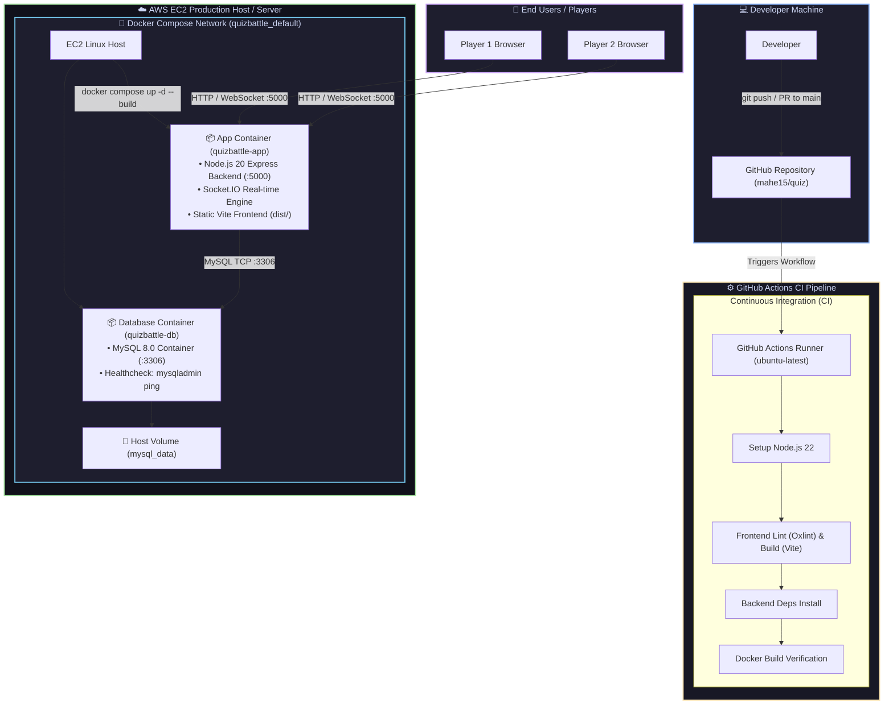
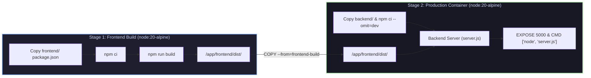
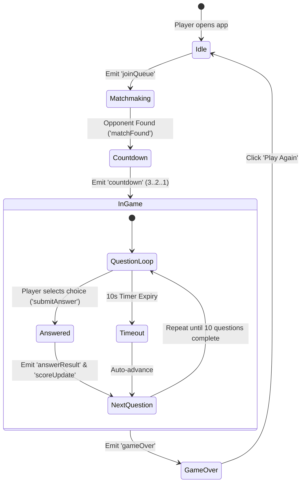

# ⚡ QuizBattle

Real-time 1v1 multiplayer quiz game built with React, Node.js, Socket.IO, and MySQL.

---

## 🏗️ System Architecture



---

## 🔄 CI Workflow Sequence Flow

```mermaid
sequenceDiagram
    autonumber
    actor Dev as Developer
    participant GH as GitHub Repository
    participant GA as GitHub Actions

    Dev->>GH: git push / pull_request to main
    GH->>GA: Trigger ci-cd.yml workflow
    
    rect rgb(30, 30, 46)
        note over GA: Continuous Integration (CI) Checks
        GA->>GA: Setup Node.js 22 & npm cache
        GA->>GA: Run Frontend Oxlint & Vite Build
        GA->>GA: Validate Backend dependencies
        GA->>GA: Test Dockerfile multi-stage build (quizbattle:ci)
    end
    
    GA-->>Dev: Pipeline Succeeded ✅
```



---

## 📦 Container Multi-Stage Build Architecture



---

## ✨ Features

- **1v1 Real-time Battles** — Challenge other players head-to-head instantly.
- **Instant Matchmaking** — Queue system powered by Socket.IO.
- **Speed Scoring System** — Faster responses score higher: `100 base + (remaining_sec × 5)`.
- **10 Questions per Match** — 10 seconds per question with auto-advance on timeout.
- **Modern Responsive UI** — Dark theme, glassmorphism, Framer Motion animations.
- **Confetti Victory Celebrations** 🎉
- **Automated CI Pipeline** — Automated linting, building, and Docker image validation via GitHub Actions.

---

## 🛠️ Tech Stack

| Layer | Technology | Description |
| :--- | :--- | :--- |
| **Frontend** | React 19 + Vite | Fast SPA framework |
| **Styling** | Tailwind CSS v4 | Utility-first CSS engine |
| **Animation** | Framer Motion + Canvas Confetti | Smooth UI transitions & win effects |
| **Backend** | Node.js + Express | RESTful API & static asset server |
| **Real-time Engine** | Socket.IO | Bidirectional WebSocket matchmaking & game state sync |
| **Database** | MySQL 8.0 | Structured storage for questions & match logs |
| **Containerization** | Docker + Docker Compose | Multi-stage production image orchestration |
| **CI Pipeline** | GitHub Actions | Automated build, linting, and Docker image validation |

---

## 🚀 Quick Start

### Option 1: Docker (Recommended for Production & Local Testing)

Run the entire application (Backend + Frontend + MySQL) in one command:

```bash
docker compose up --build
```

Open [http://localhost:5000](http://localhost:5000) in your browser.

---

### Option 2: Local Development Setup

**Prerequisites:** Node.js 18+ and MySQL 8 installed locally.

#### 1. Database Setup
```bash
mysql -u root -p < database/schema.sql
mysql -u root -p < database/questions.sql
```

#### 2. Backend Setup
```bash
cd backend
cp .env.example .env   # Configure your MySQL credentials
npm install
npm run dev             # Backend starts on http://localhost:5000
```

#### 3. Frontend Setup
```bash
cd frontend
npm install
npm run dev             # Frontend starts on http://localhost:5173
```

Open [http://localhost:5173](http://localhost:5173) in **two browser tabs** and click **Play Now** in both to simulate a 1v1 battle!

---

## 📁 Project Structure

```
QuizBattle/
├── .github/
│   └── workflows/
│       └── ci-cd.yml           # GitHub Actions CI Pipeline
├── frontend/                   # React + Vite Client Application
│   └── src/
│       ├── components/         # Navbar, Hero, GameCard, QuestionCard, Timer, etc.
│       ├── pages/              # Home, Matchmaking, Game, Result
│       ├── hooks/              # useSocket, useTimer
│       └── services/           # socket.js, api.js
├── backend/                    # Node.js + Express + Socket.IO Server
│   ├── config/                 # db.js (MySQL connection pool)
│   ├── controllers/            # quizController, gameController
│   ├── routes/                 # quizRoutes
│   ├── socket/                 # socketHandler (matchmaking queue & game loops)
│   ├── utils/                  # calculateScore, shuffleQuestions
│   └── server.js               # Application entry point & static file server
├── database/                   # MySQL Schema and Initial Question Seeds
│   ├── schema.sql              # Table definitions (users, questions, matches)
│   └── questions.sql           # Seed quiz questions
├── Dockerfile                  # Multi-stage production container build
├── docker-compose.yml          # Container orchestration (App + MySQL)
├── deployment_guide.md         # Full AWS EC2 Deployment Guide
├── docker_architecture_guide.md# Docker Architecture Deep-Dive
└── README.md                   # Project documentation
```

---

## 🔑 GitHub Actions & Server Deployment Setup

### 1. Automated CI Checks

The GitHub Actions workflow (`.github/workflows/ci-cd.yml`) automatically triggers on every `push` or `pull_request` targeting the `main` branch to run the following CI tasks:
- **Build & Lint**: Installs Node.js dependencies, runs Oxlint on the frontend, and verifies Vite frontend build and backend dependency installation.
- **Docker Check**: Verifies that the multi-stage `Dockerfile` compiles cleanly without pushing to a registry.

### 2. Server Manual Deployment Setup

Since automated CD deployment is disabled, deploy updates manually on your server by connecting via SSH and running:

```bash
# Update local repository code
cd quiz
git pull origin main

# Rebuild and start container stack
docker compose up -d --build
docker image prune -f
```

---

## 🎮 Game Engine & Socket Events



### Socket Event Reference

| Direction | Event Name | Description | Payload / Details |
| :--- | :--- | :--- | :--- |
| Client → Server | `joinQueue` | Request matchmaking | `{ playerName: "Alex" }` |
| Client → Server | `leaveQueue` | Cancel matchmaking | `-` |
| Client → Server | `submitAnswer` | Submit answer choice | `{ matchId, questionIndex, answer, timeRemaining }` |
| Server → Client | `matchFound` | Opponent matched | `{ matchId, opponent: { name, score } }` |
| Server → Client | `countdown` | Match starting count | `{ seconds: 3 }` |
| Server → Client | `nextQuestion` | Broadcast question | `{ questionIndex, question, options, total }` |
| Server → Client | `answerResult` | Feedback on answer | `{ correct: true/false, correctAnswer, score }` |
| Server → Client | `scoreUpdate` | Live score state | `{ player1Score, player2Score }` |
| Server → Client | `gameOver` | Final match stats | `{ winner, player1Score, player2Score, stats }` |

---

## 🎯 Scoring Logic

| Action | Score Calculation | Example |
| :--- | :--- | :--- |
| **Correct Answer** | Base `100` pts + Speed Bonus `(Remaining Sec × 5)` | Answered in 4s (6s left): `100 + (6 × 5) = 130 pts` |
| **Wrong Answer** | `0` pts | `0 pts` |
| **Timeout / Skipped** | `0` pts | `0 pts` |

---

## 📜 License & Author

Developed by **Mahendra Desai** ([@mahe15](https://github.com/mahe15)).  
Distributed under the MIT License.
