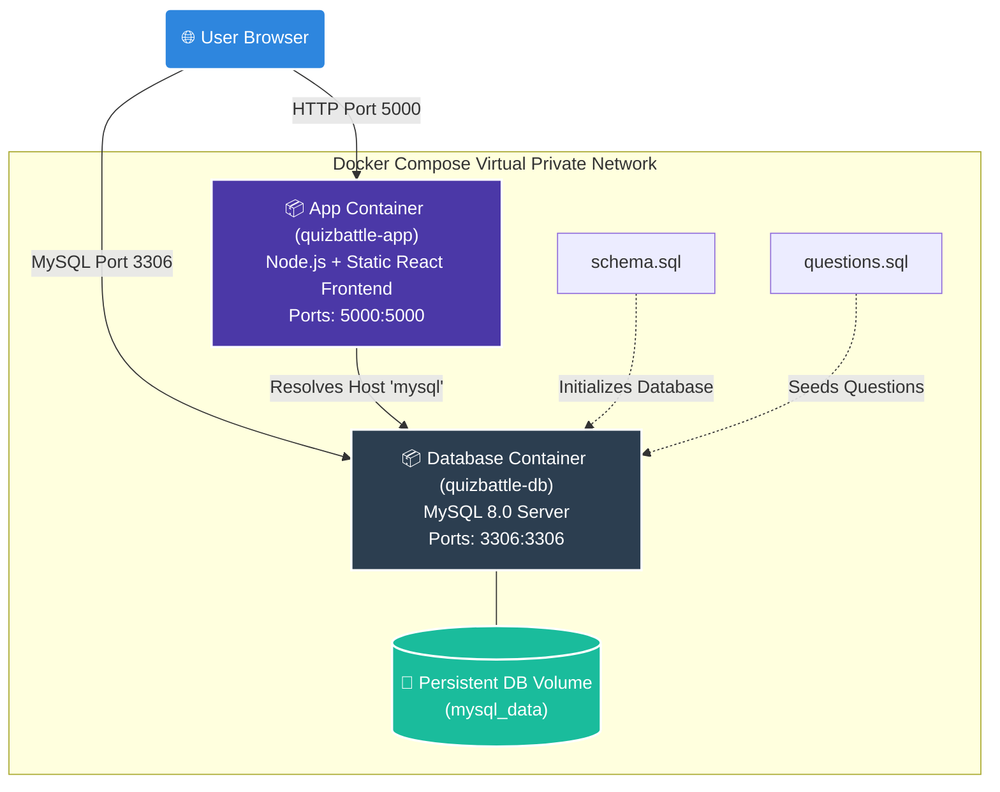

# QuizBattle — Docker & Docker Compose Architecture Guide

This guide provides a comprehensive, line-by-line explanation of the container architecture, virtual networking, database initialization, and deployment lifecycle of the **QuizBattle** application.

---

## 1. High-Level Architecture Diagram

Docker Compose orchestrates multiple isolated environments (containers) inside a virtual private network, sharing virtual volumes and forwarding internal traffic.



---

## 2. Deep Dive: The `Dockerfile`

The application uses a **Multi-Stage Build**. This approach allows us to compile the React frontend inside a temporary build container, discard the large build dependencies (like webpack, vite, and dev packages), and copy only the final optimized static files into our lightweight production Node.js container.

### Step-by-Step Breakdown

```dockerfile
# ─────────────────────────────────────────────
# Stage 1: Build Frontend
# ─────────────────────────────────────────────
FROM node:20-alpine AS frontend-build
```
- **`FROM node:20-alpine AS frontend-build`**: Pulls a lightweight Node.js v20 image running on Alpine Linux. We name this temporary environment `frontend-build` to reference it later.

```dockerfile
WORKDIR /app/frontend
```
- **`WORKDIR`**: Sets the active directory inside the container to `/app/frontend`. All subsequent commands run here.

```dockerfile
COPY frontend/package*.json ./
RUN npm ci
```
- **`COPY` / `RUN npm ci`**: Copies `package.json` and `package-lock.json` from the host system, then runs `npm ci` (clean install) which installs dependencies using the exact lockfile version. We copy dependencies *before* the source code to leverage Docker layer caching.

```dockerfile
COPY frontend/ ./
RUN npm run build
```
- **`COPY` / `RUN npm run build`**: Copies the rest of the React source code and builds the production bundles (`dist/` folder containing compiled HTML, JS, and CSS).

---

```dockerfile
# ─────────────────────────────────────────────
# Stage 2: Production Server
# ─────────────────────────────────────────────
FROM node:20-alpine AS production
```
- **`FROM node:20-alpine AS production`**: Begins a clean, new container layer. The temporary layers of Stage 1 are completely discarded here, keeping the final production image size tiny (under 150MB).

```dockerfile
WORKDIR /app
```
- Sets the production container directory to `/app`.

```dockerfile
COPY backend/package*.json ./backend/
RUN cd backend && npm ci --omit=dev
```
- Copies the backend dependencies metadata and runs `npm ci --omit=dev` to install only production dependencies (excluding dev utilities like nodemon or test frameworks).

```dockerfile
COPY backend/ ./backend/
```
- Copies the actual Express backend routes, controllers, and Socket.IO handler scripts.

```dockerfile
COPY --from=frontend-build /app/frontend/dist ./frontend/dist
```
- **`COPY --from=frontend-build`**: Copies the built React assets from Stage 1 into the production container at `/app/frontend/dist`. The Express backend is configured to host this directory statically.

```dockerfile
COPY database/ ./database/
EXPOSE 5000
```
- Copies the database backup scripts and informs Docker that the container listens on port `5000` at runtime.

```dockerfile
WORKDIR /app/backend
CMD ["node", "server.js"]
```
- **`CMD`**: The startup command of the container. Launches the Express + Socket.IO server.

---

## 3. Deep Dive: `docker-compose.yml`

Docker Compose defines and runs multi-container Docker applications. It automatically constructs a virtual network and bridges ports between your containers and host machine.

### MySQL Service Configuration

```yaml
  mysql:
    image: mysql:8.0
    container_name: quizbattle-db
    restart: unless-stopped
```
- **`image`**: Pulls the official MySQL version 8 database engine.
- **`container_name`**: Sets a descriptive alias on the network.
- **`restart: unless-stopped`**: Restarts the database container automatically if it crashes or the server reboots, unless manually stopped.

```yaml
    environment:
      MYSQL_ROOT_PASSWORD: quizbattle_root_2024
      MYSQL_DATABASE: quizbattle
```
- Configures database credentials. During first initialization, MySQL uses these parameters to create the database schema.

```yaml
    ports:
      - "3306:3306"
```
- Binds port `3306` inside the container to port `3306` on the EC2 host. This allows optional external administration (e.g. connecting via MySQL Workbench).

```yaml
    volumes:
      - mysql_data:/var/lib/mysql
      - ./database/schema.sql:/docker-entrypoint-initdb.d/01-schema.sql
      - ./database/questions.sql:/docker-entrypoint-initdb.d/02-questions.sql
```
- **`mysql_data`**: A named virtual volume mapped to `/var/lib/mysql`. It guarantees that match histories, scores, and questions persist even if you stop, rebuild, or update the MySQL container.
- **`/docker-entrypoint-initdb.d/`**: The official MySQL image executes any `.sql` scripts placed inside this directory upon initial launch. We map `schema.sql` (to create tables) and `questions.sql` (to seed 30 questions) so the database initializes itself on first start.

```yaml
    healthcheck:
      test: ["CMD", "mysqladmin", "ping", "-h", "localhost"]
      interval: 10s
      timeout: 5s
      retries: 5
```
- Sends a SQL ping command every 10 seconds to ensure MySQL is fully operational. Other services can watch this health flag.

---

### App Service Configuration

```yaml
  app:
    build: .
    container_name: quizbattle-app
    restart: unless-stopped
    ports:
      - "5000:5000"
```
- **`build: .`**: Tells Compose to construct the container image using the `Dockerfile` located in the root directory.
- **`ports: ["5000:5000"]`**: Maps port `5000` inside the container to port `5000` on the EC2 instance, allowing external browsers to access the application.

```yaml
    environment:
      PORT: 5000
      DB_HOST: mysql
      DB_PORT: 3306
      DB_USER: root
      DB_PASSWORD: quizbattle_root_2024
      DB_NAME: quizbattle
      CLIENT_URL: http://localhost:5000
```
- Configures the backend environment.
- **`DB_HOST: mysql`**: Instead of `localhost` or an IP address, we use the hostname `mysql`. Docker Compose's built-in DNS service automatically routes traffic from the app container to the database container.

```yaml
    depends_on:
      mysql:
        condition: service_healthy
```
- **`depends_on`**: Instructs the app container to wait for the database container. By checking `service_healthy`, the Node.js application will start *only* after MySQL has successfully initialized, set up tables, and is ready to process queries.

---

## 4. Virtual Networking and Data Persistence

### Named Volume (`mysql_data`)
Without a volume, database files reside in the temporary memory layer of the running container. If the container is destroyed, all data is lost.
Docker Compose mounts a physical directory on the host system to `/var/lib/mysql` inside the container, securing your match logs.

### Virtual Network
Docker Compose automatically creates a virtual bridge network. Containers on this network can communicate with one another using their service names.
- **`app` container** connects to the database via `mysql:3306`.
- Direct external traffic is blocked, except through the explicitly opened host ports (`5000` and `3306`).

---

## 5. Summary of Lifecycle Commands

- **Build and Start**:
  ```bash
  docker compose up -d --build
  ```
  *(Checks changes, builds images, seeds schema & questions, and starts all containers in the background).*

- **Check Status**:
  ```bash
  docker compose ps
  ```

- **Read logs**:
  ```bash
  docker compose logs -f
  ```

- **Stop Containers (keeping database data)**:
  ```bash
  docker compose down
  ```

- **Stop Containers and wipe database data (clean state)**:
  ```bash
  docker compose down -v
  ```
fixed    